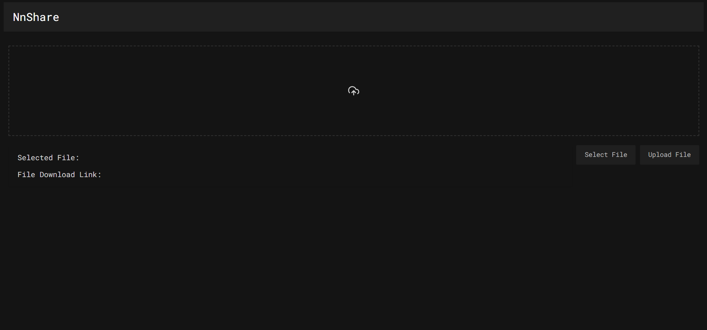

# NnShare

> [NnShare Live Demo](https://ihefty.github.io/NnShare/)
> 
NnShare is a simple web app for uploading files and generating download links using Firebase.

## Previews




## Features

- **File Upload**: Easily upload files from your local machine.
- **Link Generation**: Automatically generate a download link for the uploaded file.
- **Firebase Storage**: Utilizes Firebase for file storage, ensuring scalability and reliability.

## Technology Stack

- **HTML**: Structure of the web application.
- **CSS**: Styling and layout.
- **JavaScript**: Client-side scripting and Firebase integration.
- **Firebase**: Used for storage of uploaded files.

## Firebase Configuration

Make sure to set up your Firebase project and replace the configuration in your JavaScript file with your own project credentials.

### Firebase Rules

#### Storage Rules

```plaintext
service firebase.storage {
  match /b/{bucket}/o {
    match /{allPaths=**} {
      allow read, write: if true;
    }
  }
}
```

#### Realtime Database Rules

```json
{
  "rules": {
    ".read": false,
    ".write": false
  }
}
```

## Getting Started

To get a copy of the project up and running on your local machine, follow these steps:

1. **Clone the Repository**:
   ```bash
   git clone https://github.com/IHEfty/NnShare.git
   cd NnShare
   ```

2. **Open the HTML File**: Open `index.html` in your web browser.

3. **Set Up Firebase**: Make sure to replace the Firebase configuration in your JavaScript file with your own project credentials.

## Usage

1. Visit the NnShare web application in your browser.
2. Click on the "Upload File" button to select a file from your local machine.
3. After the upload is complete, a download link will be generated. Click the link to download the file.

## Contributing

If you would like to contribute to this project, please follow these steps:

1. Fork the repository.
2. Create a new branch (`git checkout -b feature/YourFeature`).
3. Make your changes.
4. Commit your changes (`git commit -m 'Add some feature'`).
5. Push to the branch (`git push origin feature/YourFeature`).
6. Open a pull request.

## License

This project is licensed under the MIT License - see the [LICENSE](LICENSE) file for details.

## Author

Ismail Hossen Efty (IH Efty)

---
